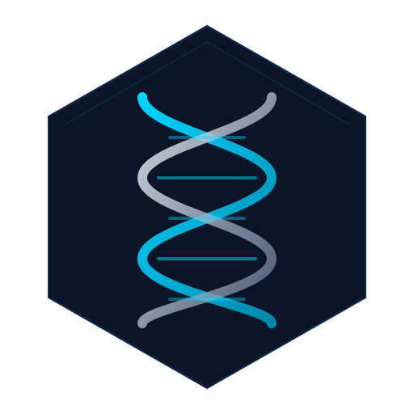

<p align="center">
  
</p>

<h1 align="center">Helix</h1>

<p align="center">
  Unified infrastructure monitoring for Prometheus, Alertmanager, Loki, Wazuh, and CrowdSec.
</p>

<p align="center">
  <a href="LICENSE"></a>
  
  
  
</p>

---

A monitoring dashboard that consolidates five backend services into a single interface. Built for homelab infrastructure running behind Caddy and Authelia.

Rather than switching between Grafana, the Wazuh dashboard, and CrowdSec's CLI to understand the state of things, Helix surfaces alerts, logs, metrics, security events, and ban decisions in one place with real-time updates.

## Features

**Command Centre** - D3 force-directed topology graph of the service mesh, active alerts from Prometheus and Wazuh, system metric sparklines, and an event timeline.

**Alerts** - Unified alert table across both Prometheus and Wazuh with search, source/severity filtering, detail expansion, and the ability to create Alertmanager silences directly.

**Security** - Wazuh agent inventory with status and scan triggers, HIDS alerts, file integrity monitoring events, and CrowdSec ban decisions with confirmation-gated unbanning.

**Metrics** - Time-series charts for system resources (CPU, memory, disk, network), per-container resource usage, and network probe results. Backed by Prometheus range queries with an adjustable time window.

**Logs** - Loki log viewer with container filtering, text search, and virtualised scrolling. Supports both polling and live tail mode via SSE.

## Architecture

```
                  Caddy (TLS + Authelia)
                         |
                       Helix (Next.js)
                     /   |   |   \    \
              Prometheus  |  Loki  |   CrowdSec
             Alertmanager |        |
                     Wazuh Manager
                     Wazuh Indexer
```

Helix is stateless. Next.js API routes proxy requests to each backend, handling authentication, input validation, and caching. No data is stored locally.

For real-time updates, Alertmanager and Wazuh push webhooks into an in-memory event bus. Browsers subscribe to that bus over SSE. When an event arrives, TanStack Query caches get invalidated so the UI refreshes immediately without waiting for the next poll cycle.

A server-side LRU cache (50 entries, 5s TTL, 50MB cap) sits in front of upstream requests to reduce redundant calls when multiple clients are connected.

## Setup

### Prerequisites

- Node.js 20+
- Docker (for production deployment)
- Backend services already running: Prometheus, Alertmanager, Loki, Wazuh Manager + Indexer, CrowdSec

### Configuration

```sh
cp .env.example .env.local
```

Defaults assume a shared Docker network where services are reachable by container name. At minimum, the Wazuh passwords and webhook secret need to be set.

| Variable | Description |
|---|---|
| `WEBHOOK_SECRET` | Shared secret for Alertmanager and Wazuh webhook authentication |
| `PROMETHEUS_URL` | Default: `http://prometheus:9090` |
| `ALERTMANAGER_URL` | Default: `http://alertmanager:9093` |
| `LOKI_URL` | Default: `http://loki:3100` |
| `CROWDSEC_URL` | Default: `http://crowdsec:8080` |
| `CROWDSEC_BOUNCER_API_KEY` | API key for the CrowdSec bouncer |
| `WAZUH_API_URL` | Default: `https://wazuh.manager:55000` |
| `WAZUH_API_USER` | Default: `wazuh-wui` |
| `WAZUH_API_PASSWORD` | Required |
| `WAZUH_INDEXER_URL` | Default: `https://wazuh.indexer:9200` |
| `WAZUH_INDEXER_USER` | Default: `admin` |
| `WAZUH_INDEXER_PASSWORD` | Required |
| `NODE_EXTRA_CA_CERTS` | Path to CA certificate for Wazuh self-signed TLS |

### Development

```sh
npm install
npm run dev
```

Available at `http://localhost:3000`. Backend services must be reachable from the development machine.

### Production

```sh
docker compose -f docker-compose.yml -f docker-compose.helix.yml up -d
```

The container exposes no ports directly. Caddy reaches it at `helix:3000` over the Docker network, with Authelia handling authentication. See `caddyfile.helix` for the reverse proxy configuration.

Memory is capped at 512MB. Typical usage sits around 150-250MB.

### Webhook Integration

**Alertmanager**: Add the receiver from `alertmanager-webhook.yml` to your Alertmanager configuration. Set `continue: true` so existing receivers continue to fire.

**Wazuh**: Copy `wazuh-integration/custom-helix.py` into the Wazuh Manager container at `/var/ossec/integrations/custom-helix` and add the integration block from `wazuh-integration/ossec-integration.xml` to `ossec.conf`. The webhook secret must be mounted as a file since Wazuh's integratord daemon strips environment variables from child processes. Both files include detailed setup instructions in their comments.

## Project Structure

```
src/
  app/                          # Pages and API routes
    api/
      alertmanager/             # Alerts, silences
      crowdsec/                 # Ban decisions
      health/                   # Aggregate health check (6 services)
      loki/                     # Log queries, labels, live tail
      prometheus/               # Instant and range queries, alerts, targets
      sse/events/               # SSE endpoint (event bus to browser)
      wazuh/                    # Agents, alerts, FIM events
      webhooks/                 # Webhook ingestion (Alertmanager, Wazuh)
    error.tsx                   # Error boundary
    loading.tsx                 # Loading skeleton
    not-found.tsx               # 404
  components/
    command-centre/             # Dashboard: topology graph, sparklines, alerts, timeline
    alerts/                     # Alert table, detail drawer, silence dialog
    security/                   # Agent grid, CrowdSec decisions, Wazuh alerts, FIM
    metrics/                    # Time-series charts, system metrics, container resources
    logs/                       # Log viewer, filters
    layout/                     # App shell: sidebar, header, status bar
    shared/                     # Toast notifications, confirmation dialog, glow card, etc.
    ui/                         # Primitives: button, badge, dialog, select, etc.
  lib/
    clients/                    # Server-side API clients for each backend
      tls.ts                    # Scoped undici dispatcher for Wazuh self-signed certificates
    hooks/                      # TanStack Query hooks and SSE connection management
    types/                      # TypeScript type definitions
    utils/                      # Alert unification, timing-safe comparison
    cache.ts                    # LRU cache
    event-bus.ts                # In-memory pub/sub (webhooks to SSE)
```

## Tech Stack

| Category | Technology |
|---|---|
| Framework | Next.js 14 (App Router) |
| Data fetching | TanStack Query v5 |
| Visualisation | D3 force simulation (canvas), Recharts |
| Virtualisation | TanStack Virtual |
| Animation | Framer Motion |
| Styling | Tailwind CSS |
| UI primitives | Radix UI |
| TLS | undici (scoped dispatcher) |
| Runtime | Node.js 20 on Alpine |

## License

[MIT](LICENSE)
